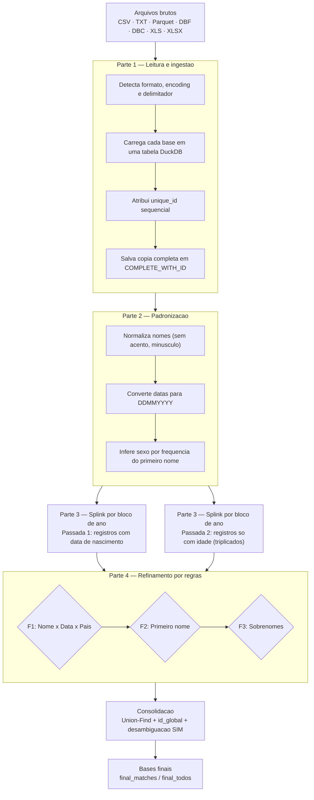
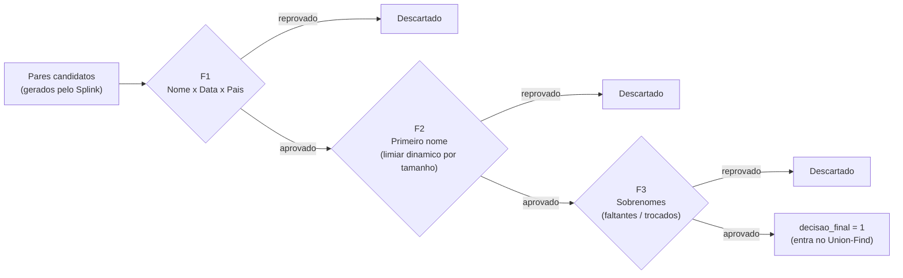

<p align="center">
  
  
  
  
  
</p>

<h1 align="center">Sistema de Deduplicação Probabilística de Registros de Saúde</h1>

<p align="center">
  <b>Record linkage</b> em larga escala para bases de saúde brasileiras (DATASUS · SINAN · SIM · SINASC · CadÚnico)<br/>
  usando <b>DuckDB</b> + <b>Splink</b> (Expectation-Maximization) + um motor de regras de refinamento desenvolvido em cima de casos reais.
</p>

<p align="center">
  <sub>Autores: Dayan Carvalho Ramos Salles de Oliveira, Alexandre Vilhena da Silva Neto, Mário Cesar Ferreira Lima Junior, Julia Stefanie Santos Mendonça </sub>
</p>

---

## Introdução

Bases de saúde pública brasileiras: SINAN, SIM, SINASC, CadÚnico, e os sistemas estaduais/municipais que se alimentam delas, quase nunca compartilham um identificador único de pessoa. O mesmo indivíduo pode aparecer dezenas de vezes ao longo dos anos, em bases diferentes, com o nome grafado de formas ligeiramente distintas, datas de nascimento digitadas com erro, campos de mãe/pai preenchidos ou não, e às vezes só uma idade aproximada em vez de uma data exata. Sem uma forma confiável de dizer "estes três registros são a mesma pessoa", qualquer análise longitudinal (série histórica de um paciente, contagem real de óbitos, cruzamento entre programas sociais e de saúde) fica sujeita a subcontagem ou duplicidade.

Este repositório contém um pipeline único em Python que resolve esse problema fim a fim: ele lê as bases originais em praticamente qualquer formato usado pelo DATASUS, padroniza os campos-chave, roda uma deduplicação probabilística com o [Splink](https://moj-analytical-services.github.io/splink/) (que aprende, via Expectation-Maximization, o quanto cada semelhança de campo pesa a favor de "é a mesma pessoa"), e então passa cada par candidato por um **motor de regras de refinamento** construído a partir de revisão manual de milhares de casos reais, porque em dados de saúde brasileiros, nome de mãe ausente, sobrenome trocado por erro de digitação e abreviações de primeiro nome são a regra, não a exceção. No final, cada indivíduo real recebe um identificador único (`id_global`) que amarra todos os seus registros, em todas as bases, ao longo do tempo.

O pipeline foi desenhado para rodar sem servidor externo (tudo em DuckDB, local), ser **retomável** após interrupções, processar bases maiores que a RAM disponível (via *spillover* para disco e processamento em blocos por ano), e permitir **auditoria e correção manual** das decisões antes da consolidação final.

> **Este projeto lida com dados pessoais sensíveis de saúde (nome, filiação, data de nascimento) sujeitos à LGPD.** 

## Sumário

- [Como funciona](#como-funciona)
- [Requisitos e instalação](#requisitos-e-instalação)
- [Estrutura de pastas](#estrutura-de-pastas)
- [Formatos de arquivo suportados](#formatos-de-arquivo-suportados)
- [Como usar](#como-usar)
- [Configuração (`UserConfig`)](#configuração-userconfig)
- [Detecção automática de colunas](#detecção-automática-de-colunas)
- [Modos especiais](#modos-especiais)
- [Sistema de refinamento por regras](#sistema-de-refinamento-por-regras)
- [Clusterização e IDs globais](#clusterização-e-ids-globais)
- [Arquivos de saída](#arquivos-de-saída)
- [Retomada e auditoria manual](#retomada-e-auditoria-manual)
- [Performance e memória](#performance-e-memória)
- [Logs](#logs)
- [Limitações conhecidas](#limitações-conhecidas)
- [Licença](#licença)

---

## Como funciona

O script roda como um script único, não é um pacote importável, e não tem argumentos de linha de comando; toda a configuração é feita editando a dataclass `UserConfig` no topo do arquivo. A execução completa passa por seis grandes etapas:



Em resumo:

1. **Leitura e ingestão** (`part1_read_files`) — varre a pasta de dados, identifica o formato de cada arquivo, detecta automaticamente encoding e delimitador, carrega cada base numa tabela DuckDB, detecta as colunas relevantes (nome, nome da mãe, nome do pai, data de nascimento, sexo, código do município, idade) e atribui um `unique_id` sequencial a cada registro, preservando uma cópia completa em Parquet (`COMPLETE_WITH_ID/`).
2. **Padronização** (`part2_standardize_data`) — constrói a tabela unificada `master_dedup`: nomes normalizados (sem acentos, minúsculos, sem caracteres especiais), datas convertidas para `DDMMYYYY`, sexo padronizado por **inferência de frequência** do primeiro nome, e extração do primeiro nome de cada campo. Nomes inválidos (placeholders como "sem informação", "ignorado") viram `NULL` em vez de descartar o registro.
3. **Deduplicação com Splink** (`part3_deduplicate`) — roda o pareamento probabilístico **bloco a bloco por ano de nascimento** (agrupando anos conforme a memória disponível), com blocking por ano/sexo/(opcionalmente) município. Uma segunda passada ("Passada 2") trata registros sem data de nascimento (só idade + data de notificação), triplicando-os em três candidatos de ano para tolerar a imprecisão da idade declarada.
4. **Refinamento por regras** (`apply_refinement_block`) — um funil sequencial de filtros (ver diagrama abaixo) que substitui/reforça a decisão bruta do Splink para os pares de fronteira, com regras calibradas manualmente sobre dados reais.
5. **Consolidação** (`consolidate_results`) — aplica **Union-Find** sobre todos os pares aprovados para formar clusters transitivos, atribui `id_global` único por cluster, resolve o caso de clusters com 2+ registros do SIM, e dá `id_global` próprio a quem não pareou.
6. **Bases finais** (`criar_bases_finais`) — junta os resultados com os dados originais completos (preservados na Parte 1), gerando os arquivos finais em chunks quando necessário.

### O funil de refinamento (F1 → F2 → F3)



Cada par que passa por esse funil recebe um `decision_reason` textual (ex.: `"F3: sobrenome mae insuficiente"`), o que torna o arquivo `pares_auditoria.parquet` auditável linha a linha — é possível entender exatamente por que cada par foi aprovado ou rejeitado, e corrigir manualmente quando necessário (ver [Retomada e auditoria manual](#retomada-e-auditoria-manual)).

---

## Requisitos e instalação

- Python 3.9+ (usa `from __future__ import annotations` e type hints modernos)
- Instale as dependências com:

```bash
pip install -r requirements.txt
```

<details>
<summary><b>Ver tabela de dependências</b></summary>

| Pacote | Uso |
|---|---|
| `duckdb` | Motor SQL principal (armazenamento, joins, transformação, spill-to-disk) |
| `splink` | Deduplicação probabilística (API `Linker`, `SettingsCreator`, `DuckDBAPI`, `CustomRule`) |
| `pandas` | Leitura de Excel e utilitários pontuais |
| `polars` | Estruturas intermediárias eficientes (registro de DataFrames no DuckDB) |
| `psutil` | Monitoramento de memória/RAM disponível |
| `chardet` | Detecção automática de encoding de arquivos texto |
| `dbfread` | Leitura de arquivos `.dbf` |
| `pysus` *(opcional)* | Descompressão de arquivos `.dbc` do DATASUS |
| `openpyxl` | Suporte a leitura de `.xlsx` via pandas |

> **`.dbc`:** se `pysus` não estiver instalado, o script tenta usar o utilitário externo `blast-dbf` (deve estar no PATH). Se nenhum dos dois estiver disponível, arquivos `.dbc` falham com erro explicativo.
>
> **Versão do Splink:** o script usa a API do Splink 4.x (`from splink import DuckDBAPI, Linker, SettingsCreator, block_on` e `from splink.blocking_rule_library import CustomRule`). Fixe a versão no `requirements.txt` compatível com essa API.

</details>

---

## Estrutura de pastas

Por padrão (configurável em `UserConfig`), o script espera/gera a seguinte estrutura:

```
linkage_models/
└── BASES/
    ├── (arquivos originais: .csv, .txt, .parquet, .dbf, .dbc, .xls, .xlsx)
    ├── originais_excel/          # .xls/.xlsx movidos para cá após conversão para CSV
    ├── dedup_database.duckdb     # banco DuckDB persistente
    ├── COMPLETE_WITH_ID/         # gerado na Parte 1: cada base + unique_id
    └── DEDUP_RESULTS/            # gerado a partir da Parte 2: resultados e bases finais
        ├── base_padronizada_pre_dedup.parquet
        ├── pares_auditoria.parquet
        ├── pares_c_match.parquet
        ├── pares_todos.parquet
        ├── final_matches[_NN].parquet
        └── final_todos[_NN].parquet
```

---

## Formatos de arquivo suportados

| Extensão | Leitura | Observações |
|---|---|---|
| `.csv`, `.txt` | `read_csv` do DuckDB | Encoding e delimitador detectados automaticamente (`chardet` + `csv.Sniffer`) |
| `.parquet` | `read_parquet` do DuckDB | Leitura direta, sem detecção de encoding |
| `.dbf` | `dbfread` | Encoding detectado testando múltiplas opções e pontuando a qualidade do texto lido; parser customizado (`SafeFieldParser`) tolera campos numéricos corrompidos comuns em DBFs do DATASUS |
| `.dbc` | `pysus` ou `blast-dbf` | Descompacta para `.dbf` internamente e usa o mesmo leitor |
| `.xls`, `.xlsx` | `pandas.read_excel` | Convertido para `.csv` automaticamente **antes** do pipeline principal; o Excel original é movido para `originais_excel/` |

---

## Como usar

1. Coloque os arquivos de origem na pasta configurada em `data_folder` (padrão: `./linkage_models/BASES`).
2. Ajuste os parâmetros de `UserConfig` conforme necessário — **isto é feito editando o próprio script**, pois não há CLI/argumentos de linha de comando.
3. Execute:

```bash
python dedup_script_refinado_v3_splink_16072026.py
```

4. Acompanhe o progresso pelo console (ou pelo arquivo de log gerado automaticamente — ver [Logs](#logs)).
5. Ao final, os resultados estarão em `DEDUP_RESULTS/`.

> O script **não possui bloco `if __name__ == "__main__":`** — a execução principal roda diretamente ao nível do módulo. Ele **não deve ser importado** como módulo em outro script (isso disparia todo o pipeline); foi projetado para ser executado diretamente.

O pipeline é **retomável**: se for interrompido, basta rodar novamente — ele detecta o que já foi processado e continua de onde parou (ver [Retomada e auditoria manual](#retomada-e-auditoria-manual)).

---

## Configuração (`UserConfig`)

Todos os parâmetros ajustáveis estão centralizados na dataclass `UserConfig`, no topo do script.

<details>
<summary><b>Caminhos</b></summary>

```python
data_folder: str = "./linkage_models/BASES"
complete_files_folder: str = "./linkage_models/BASES/COMPLETE_WITH_ID"
results_folder: str = "./linkage_models/BASES/DEDUP_RESULTS"
database_file: str = "./linkage_models/BASES/dedup_database.duckdb"
```
</details>

<details>
<summary><b>Limiares de similaridade (Levenshtein, 0.0–1.0)</b></summary>

Controlam o rigor da comparação fuzzy de cada campo (`1.0` = igualdade exata; `0.0` = ignora o campo):

```python
threshold_nome: float = 0.50
threshold_nome_mae: float = 0.0
threshold_nome_pai: float = 0.0
threshold_data_nascimento: float = 0.85
threshold_cod_municipio: float = 0.0
```
</details>

<details>
<summary><b>Faixas de score de nome (usadas no refinamento)</b></summary>

```python
threshold_nome_faixa_b_min: float = 0.85   # piso da faixa B
threshold_nome_faixa_c_min: float = 0.95   # piso da faixa C
threshold_nome_idade_mode_pais_ausentes: float = 0.85
threshold_nome_abreviacao: float = 0.85
```
</details>

<details>
<summary><b>Estratégia de blocking</b></summary>

```python
usar_blocagem_municipio: bool = False
usar_blocagem_ano: bool = True
usar_blocagem_sexo: bool = True
salting_partitions: int = 16  # paraleliza o predict do Splink apesar da chave de baixa cardinalidade
```

Blocking reduz drasticamente o número de comparações (só compara registros dentro do mesmo bloco), mas pares que diferem no campo de blocking (ex: erro de digitação no ano) não serão comparados. Ativar blocking por município assume que indivíduos não migram entre municípios ao longo do tempo — avalie se isso é válido para seu caso de uso.
</details>

<details>
<summary><b>Limiares de probabilidade do Splink</b></summary>

```python
threshold_match_probability_predict: float = 0.6     # Passada 1 (com data de nascimento)
threshold_match_probability_cluster: float = 0.02
threshold_match_probability_predict_idade: float = 0.01  # Passada 2 (idade, sem data)
threshold_match_probability_cluster_idade: float = 0.07
```
</details>

<details>
<summary><b>Ativação de sistemas, SINASC, bases de referência e limpeza de nomes</b></summary>

```python
usar_splink: bool = True
usar_decisao_refinada: bool = True   # aplica o pipeline de regras F1/F2/F3 por cima do Splink

sinasc_mae: bool = True
sinasc_filho: bool = False

SIM_BASE_FINAL: bool = False
CADUNIC_BASE_FINAL: bool = False

aplicar_limpeza_nomes: bool = True
tamanho_minimo_nome: int = 4
termos_invalidos_exatos: List[str] = [...]   # placeholders (ex: "ignorado", "sem informacao")
termos_invalidos_regex: List[str] = [...]    # padrões regex (ex: "hospital", "recem nascido")
```
</details>

<details>
<summary><b>Sobrenomes (usado no refinamento F3)</b></summary>

```python
max_sobrenome_faltante_pessoa: int = 1
max_sobrenome_trocado_pessoa: int = 0
max_sobrenome_faltante_pais: int = 2
max_sobrenome_trocado_pais: int = 1
threshold_sobrenome_grudado_total: int = 85
```
</details>

---

## Detecção automática de colunas

Para cada base, o script tenta localizar automaticamente as colunas relevantes comparando (case-insensitive) contra listas de nomes possíveis definidas em `UserConfig` (`possible_names_nome`, `possible_names_nome_mae`, `possible_names_nome_pai`, `possible_names_cod_municipio`, `possible_names_data_nascimento`, `possible_names_sexo`, `possible_names_idade`, `possible_names_data_notificacao`). Já cobrem variações comuns do DATASUS/SINAN/SIM/SINASC/CadÚnico, mas **podem (e devem) ser estendidas** se seu conjunto de bases usar nomes de coluna diferentes.

Regras de detecção:
- `nome`: **obrigatório** — se não encontrado, o arquivo falha com erro explícito.
- `data_nascimento` **ou** (`idade` + `data_notificacao`): pelo menos um dos dois conjuntos é obrigatório.
- `nome_mae`, `nome_pai`, `cod_municipio`, `sexo`: opcionais — se ausentes, o script avisa e usa `NULL`.

---

## Modos especiais

### SINASC (mãe/filho)

Quando um arquivo com `SINASC` no nome é detectado, o script exige que **exatamente um** dos flags `sinasc_mae`/`sinasc_filho` seja `True`:

- **`sinasc_mae=True`** — deduplica **mães**: `NOMEMAE` → nome, `DTNASCMAE` → data de nascimento, `CODMUNRES` → município, sexo forçado para `F`.
- **`sinasc_filho=True`** — deduplica **crianças**: `NOMEMAE` → nome do indivíduo (a criança é identificada pelo nome da mãe), `DTNASC` → data de nascimento, `NOMEPAI` → campo de suporte.

### Bases de referência (SIM / CadÚnico)

Arquivos cujo nome contém `SIM` ou `CADUNICO` são tratados como **bases de referência**: registros da mesma base de referência **nunca são comparados entre si**. Após a clusterização, uma etapa de **desambiguação** (`desambiguar_sim`) resolve clusters onde 2+ registros do SIM acabaram no mesmo `id_global` — um algoritmo de propagação de afinidade por nó reatribui os registros das demais bases ao SIM mais compatível, subdividindo o cluster quando necessário.

`SIM_BASE_FINAL`/`CADUNIC_BASE_FINAL` controlam se registros **não pareados** dessas bases aparecem nas bases finais.

### Modo "idade" (sem data de nascimento)

Bases que só têm `idade` + `data_notificacao` passam por um fluxo especial: cada registro é **triplicado** em três candidatos de ano de nascimento (`ano_notificação − idade − 1`, `ano_notificação − idade`, `ano_notificação − idade + 1`), para tolerar o arredondamento da idade declarada. A "Passada 2" roda depois da Passada 1, comparando apenas pares em que pelo menos um lado é um registro só-idade, com limiares mais permissivos e sem comparação de data. Ao final, os pares duplicados pela triplicação são colapsados de volta, mantendo o melhor par (maior score de nome; em empate, o ano exato calculado da idade).

---

## Sistema de refinamento por regras

Além do Splink, o script aplica uma cascata de filtros determinísticos (ver diagrama em [Como funciona](#como-funciona)), desenvolvidos a partir de revisão manual de casos reais:

- **F1 — Nome × Data × Pais:** aprova pares com base em combinações de score de nome, score de data de nascimento e presença/força do score de nome da mãe/pai. Rejeita automaticamente pares em que mãe **ou** pai caiu numa "zona cinzenta" (score entre 15 e 50) — nome parcialmente parecido, mas não o suficiente para confirmar nem descartar.
- **F2 — Primeiro nome:** usa uma tabela de limiares de Levenshtein **dinâmicos por tamanho do primeiro nome** (mais rígidos para nomes curtos), estratificados em faixas A (score de nome completo 50–85), B (85–95) e C (≥95). Contempla abreviações (ex.: "M." para "Maria") apenas nas faixas B/C.
- **F3 — Sobrenomes:** calcula a sobreposição de sobrenomes entre os dois lados (matching guloso por Levenshtein + heurísticas de abreviação/iniciais/preposições `DE/DA/DO/DOS/DAS`), rejeitando pares com sobrenomes "faltantes" ou "trocados" acima dos limites configurados. Uma regra de "repescagem" junta o nome completo sem espaços e recalcula Levenshtein — resgatando sobrenome grudado por erro de digitação.

Há um fluxo equivalente (F1-ID/F2-ID/F3-ID) para os pares do "modo idade", com regras ligeiramente mais permissivas (sem data de nascimento para desempatar). Cada par rejeitado recebe um `decision_reason` textual, útil para auditoria.

---

## Clusterização e IDs globais

Após todos os blocos serem processados, `consolidate_results`:

1. Aplica **Union-Find** (disjoint-set com path compression e union by rank) sobre todos os pares aprovados — formando clusters transitivos.
2. Gera um `id_global` sequencial (`cluster_0001`, `cluster_0002`, …) para cada cluster.
3. Resolve a desambiguação de múltiplos registros do SIM por cluster.
4. Atribui `id_global` próprio (singleton) a registros sem nenhum par aprovado.

---

## Arquivos de saída

Todos em `DEDUP_RESULTS/`:

| Arquivo | Conteúdo |
|---|---|
| `base_padronizada_pre_dedup.parquet` | Dados padronizados antes da deduplicação |
| `pares_auditoria.parquet` | **Todos** os pares avaliados, com scores por campo, decisão do Splink, decisão refinada, decisão final e o motivo (`decision_reason`) — arquivo principal para auditoria manual |
| `pares_c_match.parquet` | Apenas registros pareados, com `id_global` |
| `pares_todos.parquet` | Índice enxuto (id + `id_global` + flags) cobrindo todos os registros |
| `final_matches[_NN].parquet` | Dados originais completos de todos os registros que pareraram, com `id_global` e flags |
| `final_todos[_NN].parquet` | Dados originais completos de **todos** os registros, com `id_global` e flags |

> Arquivos grandes são exportados em **chunks numerados** (`_01`, `_02`, …) quando o volume estimado excede o limite de memória disponível.

Colunas de flag: `have_match` (fez parte de algum cluster com 2+ registros), `pareado` (idem, em `resultado_final`), `pareado_sim` (cluster contém ao menos um registro do SIM), `SUB_PAR_SIM` (registro afetado pela desambiguação SIM).

---

## Retomada e auditoria manual

O pipeline foi construído para **suportar interrupções** em qualquer etapa:

- **Parte 1:** bases cujo `.parquet` já existe em `COMPLETE_WITH_ID/` são puladas.
- **Parte 2:** bases já inseridas em `master_dedup` são puladas.
- **Parte 3:** anos já presentes em `pares_auditoria_acumulado` são removidos dos grupos pendentes (Passada 1 e Passada 2 rastreadas separadamente).
- Se todas as etapas já estiverem concluídas mas os arquivos de consolidação não existirem, o script pula direto para gerar as bases finais.

**Auditoria manual:** como `pares_auditoria.parquet` contém a coluna `decisao_final` para **cada par avaliado**, é possível **editar manualmente** esse arquivo (ex.: corrigir decisões após revisão humana de casos de fronteira) e rodar o script novamente. Se o script encontrar `pares_auditoria.parquet` mas **não** encontrar as bases finais completas, ele entende que houve edição pendente: sincroniza as decisões editadas, remove os arquivos de consolidação antigos e **refaz apenas a consolidação (Union-Find) e a geração das bases finais** — sem rodar o Splink novamente.

---

## Performance e memória

- **DuckDB** configurado para usar até 75% da RAM disponível, com *spillover* automático para disco (`./temp_duckdb`) e paralelismo de `cpu_count() - 2` threads.
- Antes da deduplicação, o script **estima o número de pares por ano de nascimento** (considerando o blocking por sexo) e **agrupa anos em lotes** que cabem no limite de memória, liberando memória (`gc.collect()`) entre lotes.
- Um sistema de monitoramento (`monitor()`) registra, a cada etapa de cada bloco, uso de RAM, número de registros/pares e tempo decorrido.

---

## Logs

Toda execução gera automaticamente um arquivo `log_deduplicacao_YYYYMMDD_HHMMSS.txt`, contendo cópia completa de tudo impresso no console, via a classe `Logger` — permite auditar/depurar execuções longas mesmo após fechar o terminal.
